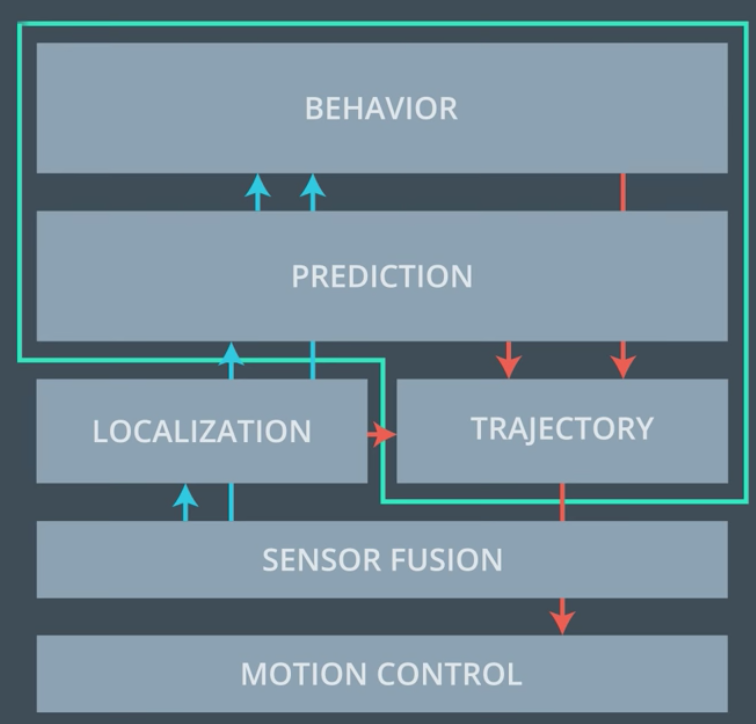
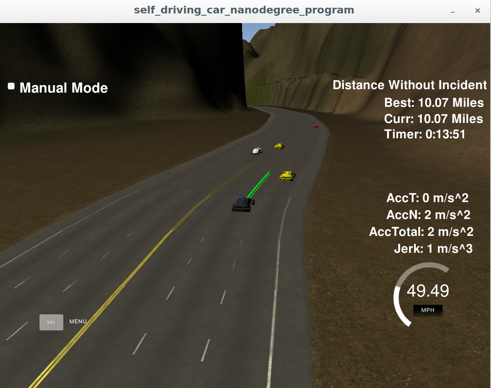
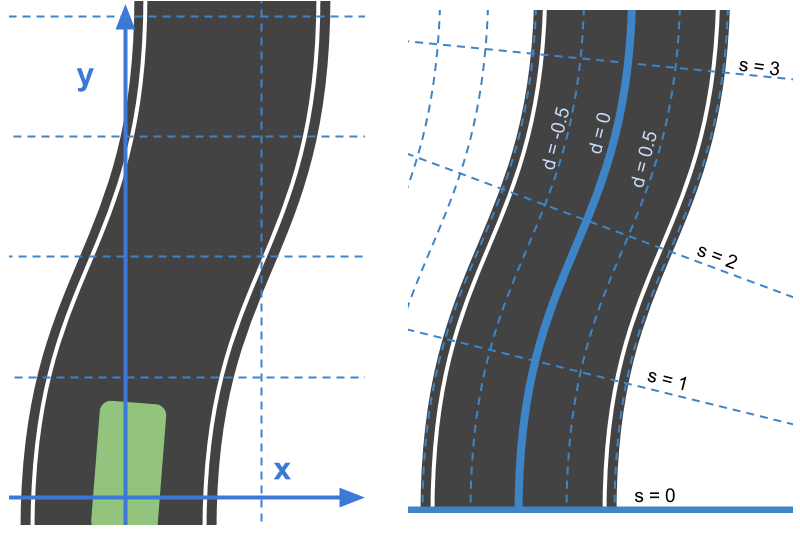
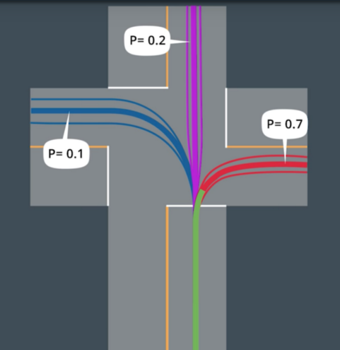
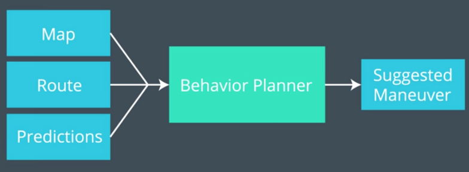
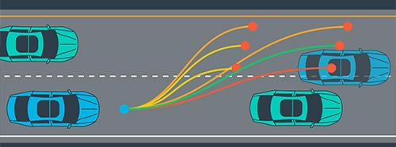
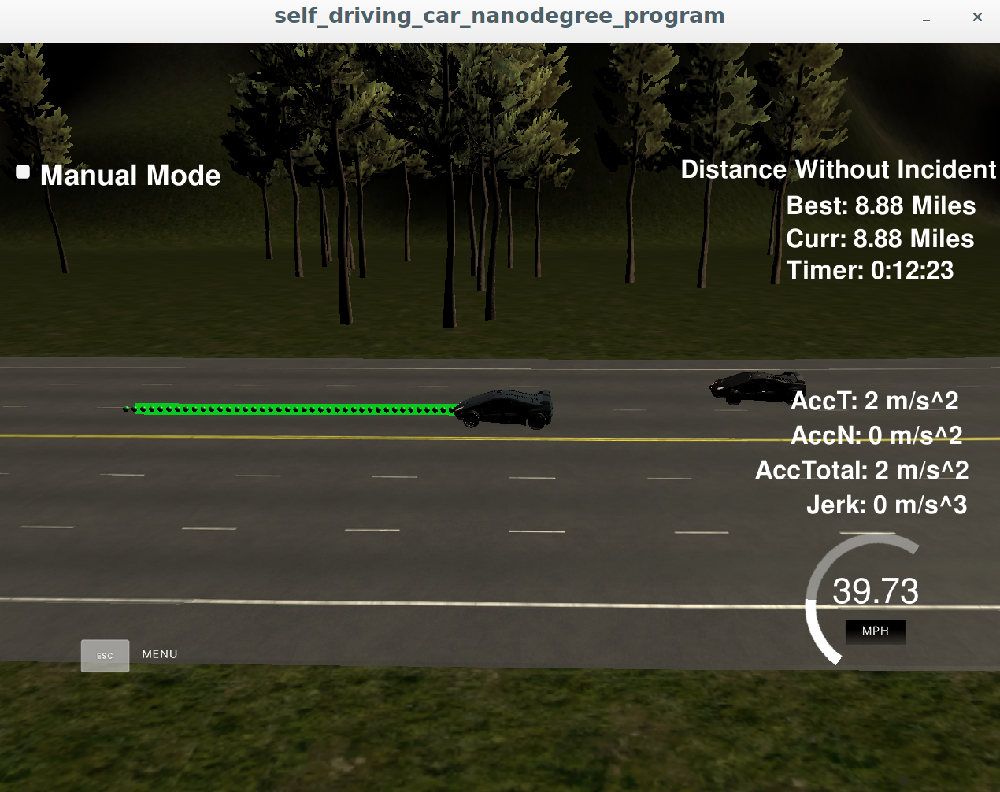
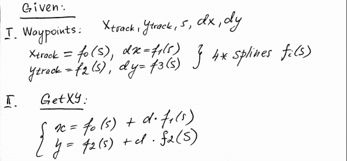
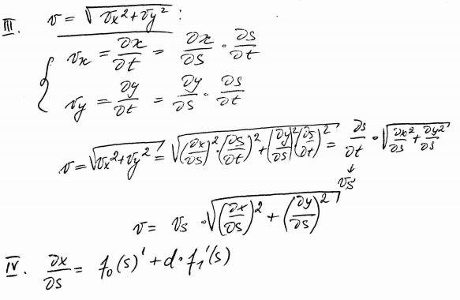

# CarND-Path-Planning-Project
Self-Driving Car Engineer Nanodegree Program
   
### Goals
In this project tge goal is to safely navigate around a virtual highway with other traffic that is driving +-10 MPH of the 50 MPH speed limit. I will be provided the car's localization and sensor fusion data, there is also a sparse map list of waypoints around the highway. The car should try to go as close as possible to the 50 MPH speed limit, which means passing slower traffic when possible, note that other cars will try to change lanes too. The car should avoid hitting other cars at all cost as well as driving inside of the marked road lanes at all times, unless going from one lane to another. The car should be able to make one complete loop around the 6946m highway. The car should not experience total acceleration over 10 m/s^2 and jerk that is greater than 10 m/s^3.



### Route plan, 
File data/highway_map.csv has list of waypoints that go all the way around the track. The track contains a total of 181 waypoints, with the last waypoint mapping back around to the first. The waypoints are in the middle of the double-yellow diving line in the center of the highway.
The track is 4.32 mile around. The car averages 50 MPH, and it takes around 5 minutes for it to go all the way around the highway.
The highway has 6 lanes total, 3 heading in each direction. Each lane is 4 m wide and the car is always in one of the 3 lanes on the right-hand side. The car stays inside a lane unless doing a lane change



### Prediction
Sensor Fusion provides data format for each car is: [ id, x, y, vx, vy, s, d]. The id is a unique identifier for that car. The x, y values are in global map coordinates, and the vx, vy values are the velocity components, also in reference to the global map. Finally s and d are the Frenet coordinates for that car. 
"Frenet Coordinates", which are a way of representing position on a road in a more intuitive way than traditional (x,y)(x,y) Cartesian Coordinates. With Frenet coordinates, we use the variables s and d to describe a vehicle's position on the road. The s coordinate represents distance along the road and the dd coordinate represents side-to-side position on the road.



The vx, vy values are used for predicting where the cars will be in the future.I assume the tracked car kept moving along the road, then its future predicted Frenet s value are its current s value plus its (transformed) total velocity (m/s) multiplied by the time elapsed into the future (s).



### Behavior plan
Any time the ego vehicle approaches a car in front of it that is moving slower than the speed limit, the ego vehicle considers changing lanes.
The car only changes lanes if such a change would be safe, and also if the lane change would help it move through the flow of traffic better.
For safety, a lane change path optimizes the distance away from other traffic. For comfort, a lane change path results in low acceleration and jerk. 



### Trajectory generation
My path planner outputs a list of x and y global map coordinates. Each pair of x and y coordinates is a point, and all of the points together form a trajectory. 
Every 20 ms the car moves to the next point on the list. The car's new rotation becomes the line between the previous waypoint and the car's new location.
The car moves from point to point perfectly, so I don't need to build a controller for this simulation.



I start the new path with whatever previous path points were left over from the last cycle. Then I append new waypoints.Using information from the previous path ensures that there is a smooth transition from cycle to cycle. But the more waypoints I use from the previous path, the less the new path will reflect dynamic changes in the environment.
Ideally, we should only use a few waypoints from the previous path and then generate the rest of the new path based on new data from the car's sensor fusion information.
The path planning program is at least one 20 ms cycle behind. The simulator will simply keep progressing down its last given path while it waits for a new generated path.As long as the new path incorporates a sufficient length of the previous path, the transition will still be smooth.

The velocity of the car depends on the spacing of the points, the larger the spacing between points, the faster the car will travel. 



To create smooth trajectories I use http://kluge.in-chemnitz.de/opensource/spline/




### Simulator.
You can download the Term3 Simulator which contains the Path Planning Project from the [releases tab (https://github.com/udacity/self-driving-car-sim/releases).


#### The map of the highway is in data/highway_map.txt
Each waypoint in the list contains  [x,y,s,dx,dy] values. x and y are the waypoint's map coordinate position, the s value is the distance along the road to get to that waypoint in meters, the dx and dy values define the unit normal vector pointing outward of the highway loop.

The highway's waypoints loop around so the frenet s value, distance along the road, goes from 0 to 6945.554.

## Basic Build Instructions

1. Clone this repo.
2. Make a build directory: `mkdir build && cd build`
3. Compile: `cmake .. && make`
4. Run it: `./path_planning`.

Here is the data provided from the Simulator to the C++ Program

#### Main car's localization Data (No Noise)

["x"] The car's x position in map coordinates

["y"] The car's y position in map coordinates

["s"] The car's s position in frenet coordinates

["d"] The car's d position in frenet coordinates

["yaw"] The car's yaw angle in the map

["speed"] The car's speed in MPH

#### Previous path data given to the Planner

//Note: Return the previous list but with processed points removed, can be a nice tool to show how far along
the path has processed since last time. 

["previous_path_x"] The previous list of x points previously given to the simulator

["previous_path_y"] The previous list of y points previously given to the simulator

#### Previous path's end s and d values 

["end_path_s"] The previous list's last point's frenet s value

["end_path_d"] The previous list's last point's frenet d value

#### Sensor Fusion Data, a list of all other car's attributes on the same side of the road. (No Noise)

["sensor_fusion"] A 2d vector of cars and then that car's [car's unique ID, car's x position in map coordinates, car's y position in map coordinates, car's x velocity in m/s, car's y velocity in m/s, car's s position in frenet coordinates, car's d position in frenet coordinates. 

---

## Dependencies

* cmake >= 3.5
 * All OSes: [click here for installation instructions](https://cmake.org/install/)
* make >= 4.1
  * Linux: make is installed by default on most Linux distros
  * Mac: [install Xcode command line tools to get make](https://developer.apple.com/xcode/features/)
  * Windows: [Click here for installation instructions](http://gnuwin32.sourceforge.net/packages/make.htm)
* gcc/g++ >= 5.4
  * Linux: gcc / g++ is installed by default on most Linux distros
  * Mac: same deal as make - [install Xcode command line tools]((https://developer.apple.com/xcode/features/)
  * Windows: recommend using [MinGW](http://www.mingw.org/)
* [uWebSockets](https://github.com/uWebSockets/uWebSockets)
  * Run either `install-mac.sh` or `install-ubuntu.sh`.
  * If you install from source, checkout to commit `e94b6e1`, i.e.
    ```
    git clone https://github.com/uWebSockets/uWebSockets 
    cd uWebSockets
    git checkout e94b6e1
    ```


